# !!! SPOILER WARNING !!!

## Figuring out the rules of panels is a big part of the original [The Witness](http://store.steampowered.com/app/210970/The_Witness) game.
## It is advised to play The Witness first and learn the rules the way it was intended.

&nbsp;  

&nbsp;  

&nbsp;  

&nbsp;  

&nbsp;  

&nbsp;  

&nbsp;  

&nbsp;  

&nbsp;  

&nbsp;  

&nbsp;  

&nbsp;  

# The Witness rules guide

## Lines rule
Panel may have single line or two symmetric lines.  
Symmetric lines may be mirrored just horizontally or both horizontally and vertically. Lines may not cross.  
One of the symmetric lines may be invisible, but it is still there.

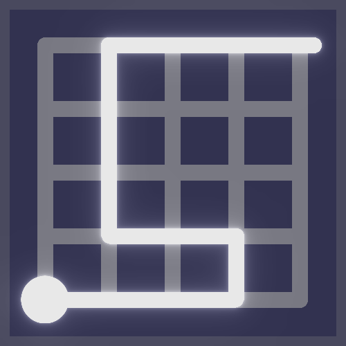&nbsp;
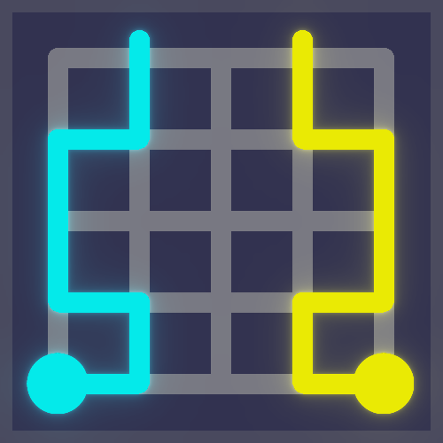&nbsp;
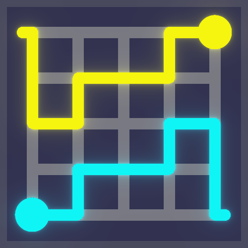&nbsp;

Lines will split panel into areas. Each area is isolated from other areas.

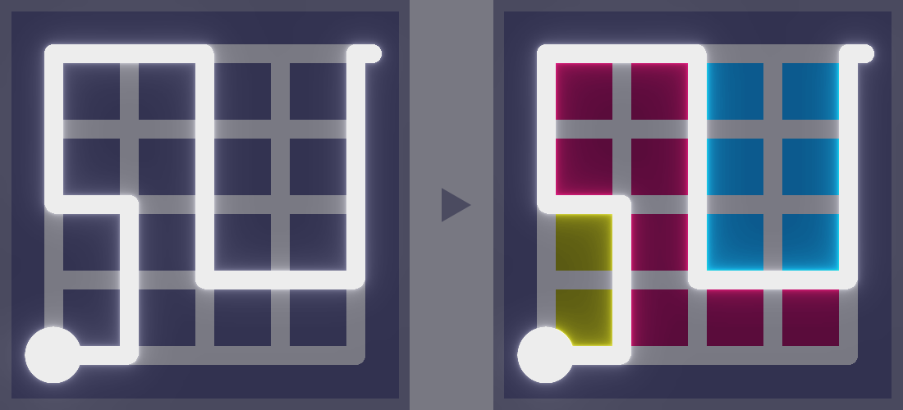  

## Hexagon rule
There may be small hexagonal dots on the panel. Lines must cross every hexagonal dot.  
If hexagon is not black, it means that it must be crossed by the line of the respective color (only in symmetric panels). Note that invisible line still has color.  
Black hexagons may be crossed by any line.

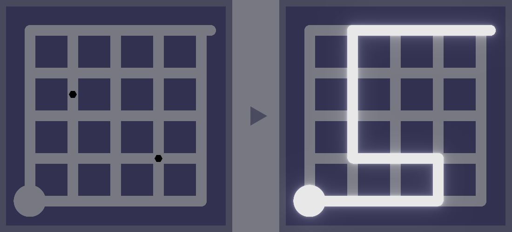&nbsp;
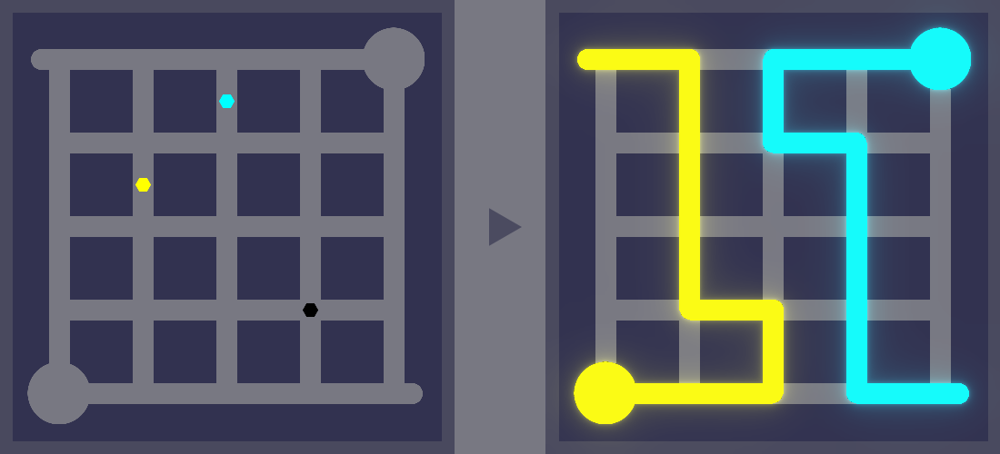

## Colored square rule
Squares of different colors should be separated into different areas. That is, there may be squares of only one color inside of one area.

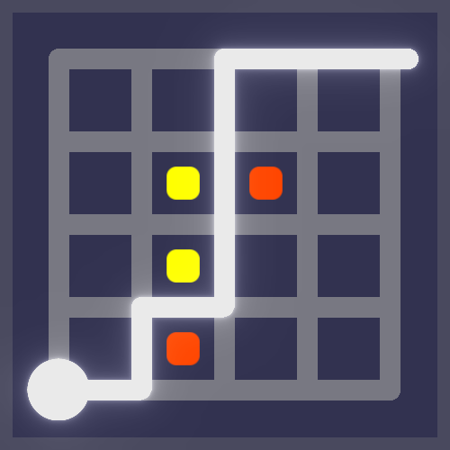

## Sun rule
Sun is a colored octagram. Each sun must have exactly one more object of the same color inside of the area – it can be another sun, square or other rule with respective color.
Colors different from the sun color __do not interfere__ with the sun rule. That means there can be 4 suns inside of one area, but two of them have to be of one color and other two of another color.

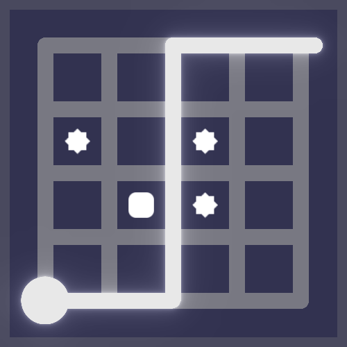&nbsp;
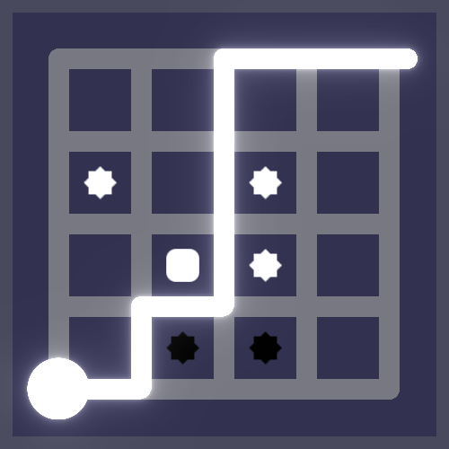

## Tetromino rule
Tetromino is a geometric shape, composed of four squares, like in Tetris. In this game shapes may have less or more than four squares, so it's technically not necessarily tetromino, but whatever.
All tetrominos inside of the area must exactly fit in the outline of the area.
Tilted tetromino shape means it can be rotated.
Blue hollow tetromino shape means that it is subtractive shape and it must be used to nullify squares of other tetrominos.

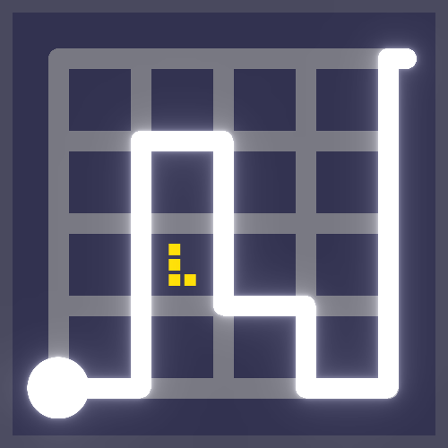  
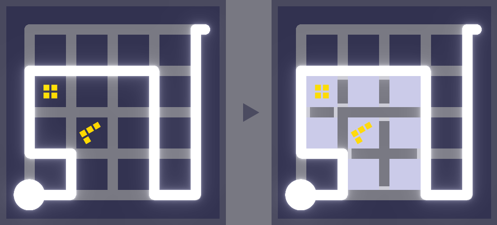  
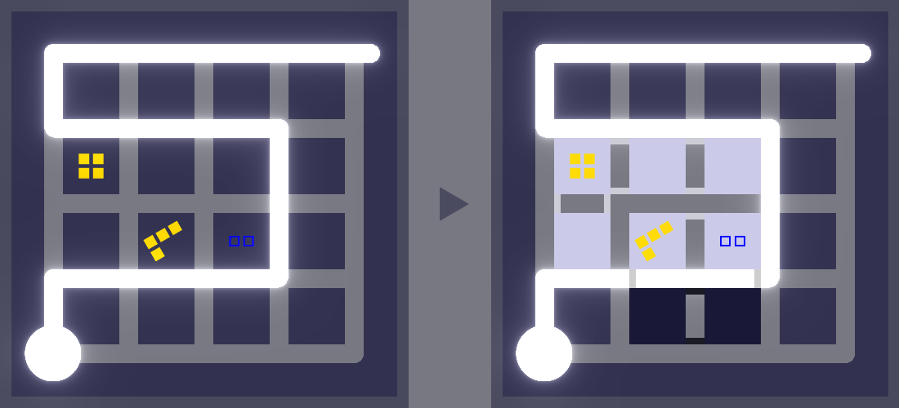

## Eraser rule
Looks like upside down Y. It means that for each eraser there must be exactly one error inside of the area. That is, this rule will eliminate any other unsatisfied rule in the area.
It may has a color that will interfere with a sun rule.

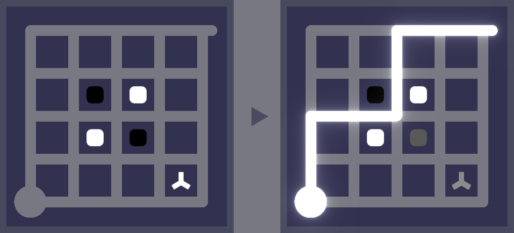  
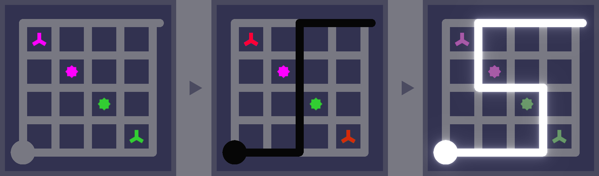

## Triangles rule / _Doritos rule_
There may be one, two or three orange triangles in a puzzle block. This rule means that exactly one, two or three edges of this block must be adjacent to the solution line(s).

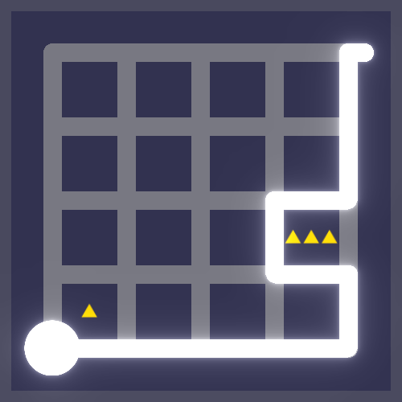&nbsp;
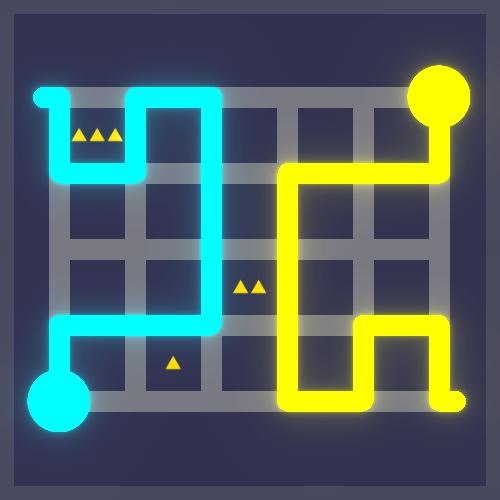
